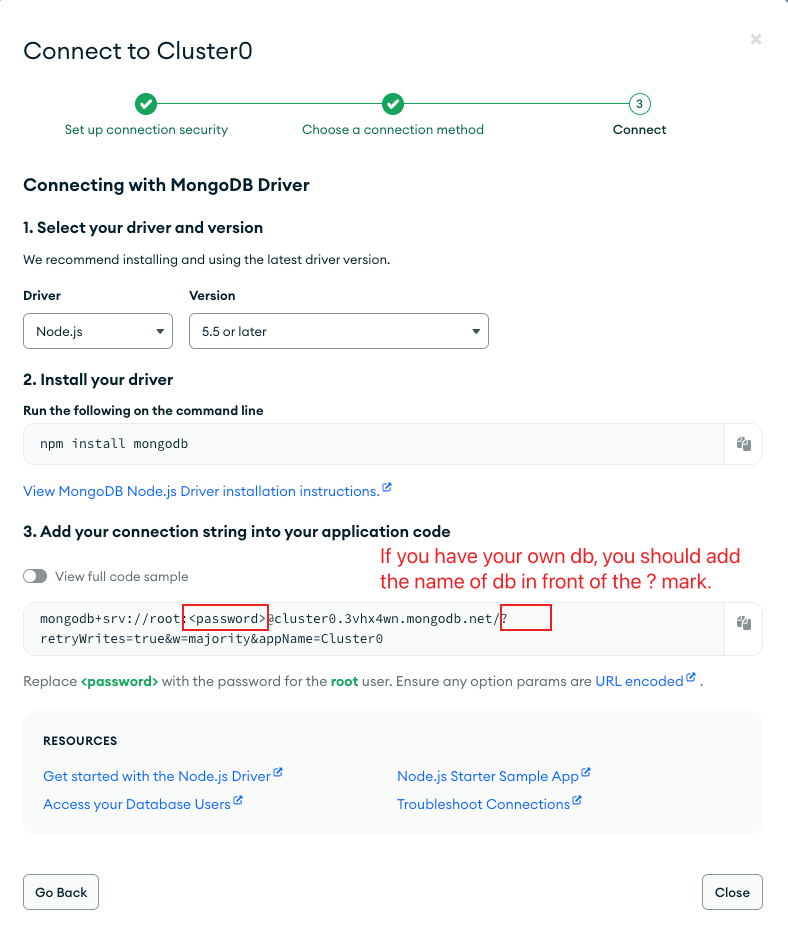
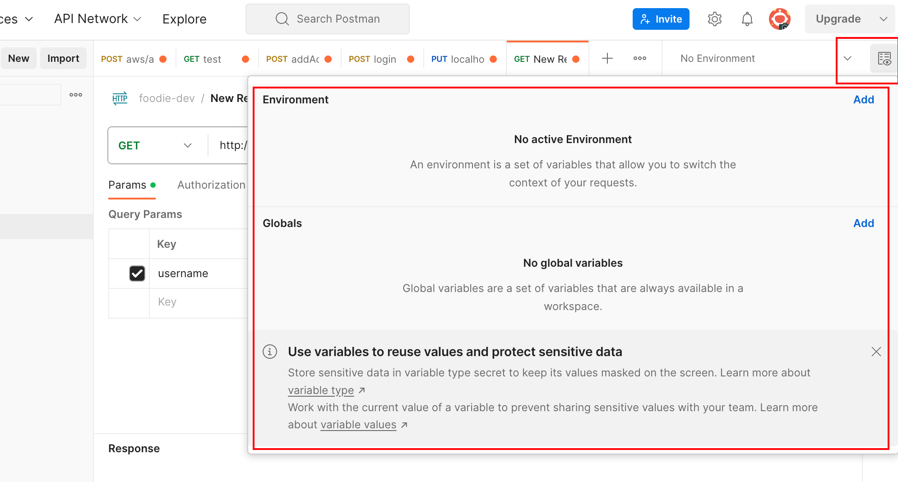

# Task Manager

这是一个可以增删改查自定义任务的的 API，该项目由 express 框架创建。 主要涵盖了：

1. 设置 router（modular&mountable）
2. 设置 controller CRUD（bussiness logic）
   1. put vs patch
3. 设置 model（ODM）
4. 配置 mongodb (db access&network access)
5. env 的设置
6. 统一 error 的设置
7. 自定义中间件
   1. async wrapper(解决 try...catch boiler plate)
   2. custom error handler(自定义错误处理逻辑)
8. 使用 postman 进行测试

## 1.Tasks Manager REST API

- `GET` api/tasks - Get All Tasks
- `POST` api/tasks - Create Task
- `GET` api/tasks/:id - Get Task
- `PUT/PATCH` api/tasks/:id - Update Task
- `DELETE` api/tasks/:id - Delete Task

## 2.Basic ways to use routing in Express:

1. **Directly using the app object**

```javascript
const express = require("express");
const app = express();

app.get("/", function (req, res) {
  res.send("Hello World!");
});

app.listen(3000, function () {
  console.log("Example app listening on port 3000!");
});
```

2. **Using the Router class to create modular, mountable route handlers**

First, create a routes file, for example `routes/todos.js`:

```javascript
const express = require("express");
const router = express.Router();

// Define the route for the todo list
router.get("/", function (req, res) {
  res.send("Todo list");
});

// Define the route for getting a single todo by ID
router.get("/:id", function (req, res) {
  res.send("Todo " + req.params.id);
});

module.exports = router;
```

Then, in the main app file, mount this route module:

```javascript
const express = require("express");
const app = express();
const todosRouter = require("./routes/todos");

// Use the routes module and specify a path for it
app.use("/todos", todosRouter);

app.listen(3000, function () {
  console.log("Example app listening on port 3000!");
});
```

This way, your application has two accessible routes: `/todos` and `/todos/:id`.

3. **Chained route handlers**

Chained route handlers allow you to provide multiple handler functions for a route. This mechanism can be used to perform a series of actions for requests, such as validation, processing, and then sending a response, or performing different functions under different conditions.

```javascript
app
  .route("/book")
  .get(function (req, res) {
    res.send("Get a random book");
  })
  .post(function (req, res) {
    res.send("Add a book");
  })
  .put(function (req, res) {
    res.send("Update the book");
  });
```

These examples show how to use routing in an Express application. You can define routes with various HTTP request methods like GET, POST, PUT, DELETE, etc., and construct the routing structure for your application's APIs and services as needed.

## 3.MongoDB and Mongoose

### 3.1 Atlas 设置

##### 3.1.1 基本设置

database access 设置账户密码/ network access 设置网络连接

##### 3.1.2connection 讲解




### 3.2 使用`dotenv`存储环境变量，避免暴露 secret info

1. 在 `.gitignore` 中添加 `.env`
2. `require("dotenv").config();`
3. `await connectDB(process.env.MONGO_URI);`

### 3.3 Schema(like JPA)

`mongoose.Schema` 是用来定义 MongoDB 集合中文档的结构的一个构造函数。在 Mongoose 中，每个 schema 都映射到一个 MongoDB 集合，并定义了该集合中的文档的形状。

下面是使用 `mongoose.Schema` 的一个基本步骤：

1. **导入 Mongoose**：首先，你需要导入 mongoose 模块。

```javascript
const mongoose = require("mongoose");
```

2. **创建 Schema**：使用 `mongoose.Schema` 构造函数来创建一个新的 schema 对象。你可以在这个对象中指定文档的字段及其类型。

```javascript
const Schema = mongoose.Schema;

const taskSchema = new Schema({
  name: {
    type: String,
    required: true,
  },
  completed: {
    type: Boolean,
    default: false,
  },
  // 更多字段...
});
```

3. **创建模型**：一旦你有了 schema，你就可以用它来创建一个模型。模型是根据 schema 结构生成的构造函数，用于创建文档的实例。

```javascript
const Task = mongoose.model("Task", taskSchema);
```

The first argument is the singular name of the collection your model is for. Mongoose automatically looks for the plural, lowercased version of your model name.

4. **使用模型**：现在你可以使用模型来创建、查询、更新或删除文档。

```javascript
// 创建新任务
const newTask = new Task({ name: "Learn Mongoose" });

// 保存任务到数据库
newTask.save((err, task) => {
  if (err) return console.error(err);
  console.log(task.name + " saved to collection.");
});

// 查询任务
Task.find({ completed: false }, (err, tasks) => {
  if (err) return console.error(err);
  console.log(tasks);
});
```

### 3.4 常见的 validation

在 Mongoose 中，schemas 支持多种内建的验证方法，以确保数据符合你的要求。以下是一些基本的验证器：

1. **required**: 验证数据是否存在。

   ```javascript
   new Schema({ name: { type: String, required: true } });
   ```

2. **min** 和 **max**: 对于数字类型，验证数据是否在指定的范围内。

   ```javascript
   new Schema({ age: { type: Number, min: 18, max: 65 } });
   ```

3. **enum**: 验证字符串是否匹配预定义的值集合。

   ```javascript
   new Schema({
     status: { type: String, enum: ["Open", "Closed", "Pending"] },
   });
   ```

4. **match**: 验证字符串是否符合指定的正则表达式。

   ```javascript
   new Schema({ email: { type: String, match: /.+@.+\..+/ } });
   ```

5. **minlength** 和 **maxlength**: 验证字符串的长度是否在指定的范围内。

   ```javascript
   new Schema({ username: { type: String, minlength: 3, maxlength: 30 } });
   ```

6. **validate**: 提供自定义的验证函数。
   ```javascript
   new Schema({
     website: {
       type: String,
       validate: {
         validator: function (v) {
           return /^(https?:\/\/)?([\da-z\.-]+)\.([a-z\.]{2,6})([\/\w \.-]*)*\/?$/.test(
             v
           );
         },
         message: (props) => `${props.value} is not a valid URL!`,
       },
     },
   });
   ```

## 4.几个重要功能中间件

### 4.1 asyncWrapper(简化 try-catch)

```js
const asyncWrapper = (fn) => {
  return async (req, res, next) => {
    try {
      await fn(req, res, next);
    } catch (error) {
      next(error);
    }
  };
};

module.exports = asyncWrapper;
```

这段代码定义了一个名为 `asyncWrapper` 的高阶函数，它的作用是包装异步的 Express 路由处理器。这样做的目的是为了减少在每个异步路由处理器中重复写 try-catch 错误处理的代码。

1. **函数定义**:
   `asyncWrapper` 是一个函数，它接受一个参数 `fn`，这个参数 `fn` 本身也是一个函数 —— 通常是一个异步的 Express 路由处理器。

2. **返回一个异步函数**:
   `asyncWrapper` 返回一个新的异步函数。这个返回的函数接受三个参数：`req`、`res` 和 `next`，这是 Express 路由处理器的标准参数：

   - `req` 代表 HTTP 请求。
   - `res` 代表 HTTP 响应。
   - `next` 是一个函数，当调用它时，Express 会转到下一个中间件或路由处理器。

3. **错误处理**:
   在返回的异步函数内部，使用了一个 try-catch 块来捕获任何可能发生的错误。`await fn(req, res, next)` 会调用传入的 `fn` 函数，并等待其解决。如果 `fn` 执行期间抛出任何错误，它将被 catch 块捕获。

4. **错误传递**:
   如果捕获到错误，`next(error)` 被调用，将错误传递给 Express 的错误处理中间件。这允许错误被统一处理，例如返回一个错误响应，或者记录错误日志等。

5. **模块导出**:
   最后，`asyncWrapper` 函数通过 `module.exports` 导出，使得它可以在其他文件中被引入和使用。

在 Express 中使用 `asyncWrapper` 可以使异步路由处理器的错误处理更加简洁。例如，你可能有以下的路由处理器：

```javascript
const asyncWrapper = require("./asyncWrapper");

const myAsyncRouteHandler = asyncWrapper(async (req, res, next) => {
  // 异步操作，可能会抛出错误
  const data = await someAsyncOperation();
  res.json(data);
});

app.get("/my-route", myAsyncRouteHandler);
```

## 5 Error 相关内容

### 5.1 Default error handler

Express comes with a built-in error handler that takes care of any errors that might be encountered in the app. This default error-handling middleware function is added at the end of the middleware function stack.

If you pass an error to next() and you do not handle it in a custom error handler, it will be handled by the built-in error handler; the error will be written to the client with the stack trace. The stack trace is not included in the production environment.

### 5.2 custom error handler

Define error-handling middleware functions in the same way as other middleware functions, except error-handling functions have four arguments instead of three: (err, req, res, next). For example:

```js
const { CustomAPIError } = require("../errors/custom-error");

const errorHandlerMiddleware = (err, req, res, next) => {
  if (err instanceof CustomAPIError) {
    return res.status(err.status).json({ msg: err.message });
  }
  // default msg
  return res
    .status(500)
    .json({ msg: "Something went wrong, please try again!" });
};

module.exports = errorHandlerMiddleware;
```

##### error class

```js
class CustomAPIError extends Error {
  constructor(msg, status) {
    super(msg);
    this.status = status;
  }
}
```

### 5.3 捕获其他错误（兜底）

将 `notFound` 设置为中间件后，它将作为一个捕获所有未匹配到现有路由的请求的处理程序。这意味着当客户端请求一个在你的 Express 应用中没有定义的路由时，`notFound` 中间件将被执行。

在 Express 中，中间件的执行顺序是按照它们在代码中出现的顺序的。由于 `notFound` 中间件是在所有的路由声明之后被使用的，它将拦截所有没有被前面的路由处理器或中间件捕获的请求。因此，它通常被用作一个“后备”处理程序，返回一个 404 Not Found 响应，表示请求的资源在服务器上未找到。

这种模式对于提供清晰的用户反馈非常有用，因为它防止了无效路由返回不明确的服务器错误。使用 `notFound` 中间件可以帮助维护一个良好的用户体验和更容易调试的服务器端逻辑。

你的 `notFound` 中间件实现非常简单：

```javascript
const notFound = (req, res) => res.status(404).send("Route does not exist");
```

它将 HTTP 状态设置为 404，并发送一个简单的文本响应 "Route does not exist"。你可以根据需要扩展这个中间件，例如，返回一个 JSON 对象，或者渲染一个专门的 404 错误页面。

### 5.4 相关知识

在 Express 中，自定义的 `errorHandlerMiddleware` 会在路由处理器或其他中间件中调用 `next` 函数并传递一个错误对象时被触发。根据 Express 的错误处理原则，错误处理中间件需要四个参数：错误对象、请求对象、响应对象和下一个中间件函数。它通常在所有路由声明的末尾被定义。

自定义错误处理中间件的结构如下所示：

```javascript
function errorHandlerMiddleware(error, req, res, next) {
  // 你的错误处理逻辑
}

// 在所有其他路由和中间件之后定义错误处理器
app.use(errorHandlerMiddleware);
```

以下是几种会触发 `errorHandlerMiddleware` 的情形：

1. **异步路由或中间件**:
   如果在异步函数中发生错误并且没有被捕获，可以使用 `next` 将错误传递出去。

   ```javascript
   app.get("/route", async (req, res, next) => {
     try {
       // 可能抛出错误的异步操作
     } catch (error) {
       next(error);
     }
   });
   ```

2. **同步路由或中间件**:
   在同步代码中，你可以直接调用 `next` 并传递一个错误对象。

   ```javascript
   app.get("/route", (req, res, next) => {
     if (someConditionNotMet) {
       const err = new Error("Some error message");
       return next(err);
     }
   });
   ```

3. **Promise 中的错误**:
   如果你在一个返回 Promise 的函数中工作，你可以将错误通过 `.catch(next)` 传递。

   ```javascript
   app.get("/route", (req, res, next) => {
     someAsyncOperation()
       .then((data) => {
         res.send(data);
       })
       .catch(next);
   });
   ```

4. **其他中间件中的错误**:
   任何其他中间件抛出的错误，如果没有被捕获和处理，也会传递给错误处理中间件。

5. **直接抛出错误**:
   在任何中间件中，你可以直接抛出错误，Express 会捕获它并将其传递给错误处理中间件。

   ```javascript
   app.use((req, res, next) => {
     throw new Error("Something went wrong!");
   });
   ```

自定义的 `errorHandlerMiddleware` 通常在你的应用服务器代码的最后部分定义，以确保它捕获所有前面中间件或路由中未处理的错误。

## 6. 设置 postman 全局变量小技巧



在 Postman 中设置`Initial Value`和`Current Value`有特定的用途：

- **Initial Value**: 这个值是与你的 Postman 账户同步的，也就是说，如果你使用 Postman 的同步功能，`Initial Value`会在你登录到任何其他系统或设备上的 Postman 时保持一致。这对于团队协作非常有用，因为它允许团队成员共享相同的环境设置，例如 API 端点或配置参数。

- **Current Value**: 这个值仅在你当前的本地实例中使用，它不会与你的 Postman 账户同步。这意味着你可以在本地修改`Current Value`而不影响团队其他成员的环境。`Current Value`通常用于存储敏感信息，比如个人的访问令牌或密码，这些信息你不希望共享给其他人。
